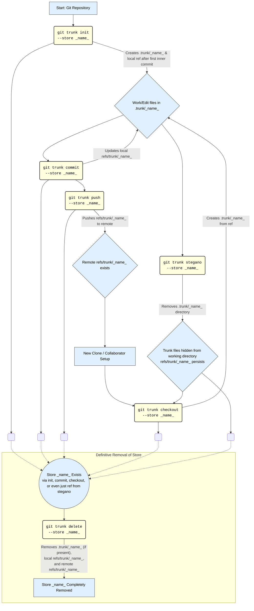

# git trunk

git trunk is a CLI tool for managing repository-wide files that are common across all branches. 

It helps you 
- Hold a single version of information that is common across all branches such as issues, bugs, changelog, history etc.
- Get steganographic i.e. conceal information in a public git repo that is non-evident.


## about 
**`git-trunk` CLI: Core Functionality**

`git-trunk` is a command-line interface tool designed to manage repository-wide documents and metadata, which are stored within a dedicated `.trunk/<store>` directory inside a Git repository. These "stores" are then tracked in the main repository using a special Git reference, typically `refs/trunk/<store>`. The primary aim is to keep certain information (like issues, changelogs, design documents) separate from the main project's branching history but still versioned and shareable within the same repository. It also offers a way to "hide" these files from the working directory on demand (steganography).

**Global Options:**

*   `-v, --verbose`: Enables detailed debug logging.
*   `-r, --remote <REMOTE>`: Specifies the Git remote to interact with (default: `origin`).
*   `-s, --store <STORE>`: Specifies the name of the "trunk store" to operate on (default: `main`). Most commands target a specific store.

## installation

**From Source**

1.  Ensure you have Rust and Cargo installed. See [rustup.rs](https://rustup.rs/).
2.  Clone the repository:
    ```bash
    git clone https://github.com/ssr1ram/git-trunk.git
    cd git-trunk
    ```
3.  Install the binary:
    ```bash
    cargo install --path .
    ```
    This will make `your-binary-name` available in your shell.

**Directly from GitHub**

1.  Ensure you have Rust and Cargo installed. See [rustup.rs](https://rustup.rs/).
2.  Install directly using Cargo:
    ```bash
    cargo install --git https://github.com/ssr1ram/git-trunk.git
    ```
    This will download the source, compile, and install `git-trunk` to `~/.cargo/bin/`.

## quick start

1. Create a store (This will create a .trunk/main directory)
    ```sh
    git trunk int
    ```


2. Edit files in the store
    ```txt
    Use your favourite editor to edit files in .trunk/main
    ```

3. Commit you changes
    ```sh
    git trunk commit
    ```

4. Push them to your remote `origin`
    ```sh
    git trunk push
    ```

5. When you next clone the repo (This will re-populate `.trunk/main` with the files)
    ```
    git trunk checkout
    ```


## flow




## commands

**Key Commands and Their Actions (Per Store):**

1.  **`init`** (`commands::init.rs`):
    *   Initializes a new trunk store.
    *   Ensures the current directory is a Git repository.
    *   Adds `.trunk` to the main repository's `.gitignore` file if not already present.
    *   Creates the `.trunk/` parent directory if it doesn't exist.
    *   Creates the specific `.trunk/<store>` directory.
    *   If `--force` is used and the directory exists, it's removed and recreated.
    *   Creates a `readme.md` file inside `.trunk/<store>`.
    *   Initializes a new Git repository within `.trunk/<store>`.
    *   Adds and commits the `readme.md` in this new inner Git repository.

2.  **`commit`** (`commands::commit.rs`):
    *   Commits changes made within an existing `.trunk/<store>` directory to the main repository's `refs/trunk/<store>` reference.
    *   Checks if `.trunk/<store>` exists and is a Git repository.
    *   Checks for uncommitted changes within `.trunk/<store>`.
    *   If changes exist (and not `--force`), prompts the user to stage and commit them within the `.trunk/<store>` repository. The commit message can be provided via `-m` or defaults to a standard message.
    *   Retrieves the latest commit hash from the `main` branch of the `.trunk/<store>` repository.
    *   Fetches the objects from the `.trunk/<store>` repository into a temporary branch in the main repository.
    *   Updates (or creates) the `refs/trunk/<store>` reference in the main repository to point to this fetched commit hash.
    *   Cleans up the temporary branch.

3.  **`checkout`** (`commands::checkout.rs`):
    *   "Checks out" or materializes a trunk store from the main repository's `refs/trunk/<store>` reference into the local `.trunk/<store>` working directory.
    *   If `refs/trunk/<store>` doesn't exist locally, it attempts to find and fetch it from the specified remote.
    *   Ensures `.trunk` is in `.gitignore`.
    *   Creates the `.trunk/` and `.trunk/<store>` directories if they don't exist.
    *   If `.trunk/<store>` already exists:
        *   If `--force` is used, it removes the existing directory.
        *   Otherwise, it prompts the user to overwrite.
    *   Initializes a Git repository in `.trunk/<store>`.
    *   Fetches the commit history from the main repository's `refs/trunk/<store>` into a temporary ref within the `.trunk/<store>` repository.
    *   Resets the `main` branch of the `.trunk/<store>` repository to this fetched commit.
    *   Ensures `HEAD` points to `main` in the `.trunk/<store>` repository.
    *   Cleans up the temporary ref.

4.  **`push`** (`commands::push.rs`):
    *   Pushes the main repository's local `refs/trunk/<store>` reference to the specified remote repository.
    *   Verifies that `refs/trunk/<store>` exists locally.
    *   Executes `git push <remote_name> refs/trunk/<store>:refs/trunk/<store>`.

5.  **`hooks`** (`commands::hooks.rs`):
    *   Manages Git hooks for a specific trunk store to automate `commit` and `push` operations.
    *   Operates within the main repository's `.git/hooks` directory.
    *   **Post-commit hook**: Can install a hook that automatically runs `git trunk commit --force --store <store>` after a commit in the main repository.
    *   **Pre-push hook**: Can install a hook that automatically attempts to `git push <remote_name> refs/trunk/<store>:refs/trunk/<store>` (or more generically, `git trunk push --store <store> --remote <remote_name>`) when the main branch of the main repository is pushed.
    *   Prompts the user before overwriting existing hooks unless `--force` is used.

6.  **`stegano`** (`commands::stegano.rs`):
    *   Removes the specified `.trunk/<store>` working directory from the filesystem.
    *   If this action results in the parent `.trunk/` directory becoming empty, `stegano` will also:
        *   Remove the empty `.trunk/` directory.
        *   Remove the `.trunk` entry from the main repository's `.gitignore` file.
    *   This command **only affects the working directory**; it does not delete the `refs/trunk/<store>` Git reference.

7.  **`delete`** (`commands::delete.rs`):
    *   Completely removes all traces of a specific git-trunk store.
    *   Prompts for user confirmation due to its destructive nature.
    *   Removes the local `.trunk/<store>` working directory.
    *   Deletes the local `refs/trunk/<store>` reference from the main repository.
    *   Deletes the `refs/trunk/<store>` reference from the specified remote repository.
    *   If the parent `.trunk/` directory becomes empty after removing `.trunk/<store>`, it is also removed (but `.gitignore` entry for `.trunk` is not touched by this command, as other stores might still exist or be intended).

8.  **`info`** (`commands::info.rs`):
    *   Displays information about the git-trunk setup and specified/discovered stores.
    *   Can operate in two modes:
        *   Default: Shows info for the store specified by `--store` (or "main"), and also discovers other stores present locally (in `.trunk/` or as `refs/trunk/*`).
        *   `--all`: Discovers all stores present on the remote under `refs/trunk/*` and displays information for each.
    *   For each store, it shows:
        *   Local `.trunk/<store>` directory: existence, whether it's a Git repo, last commit hash/date, and status (uncommitted changes).
        *   Main repository `refs/trunk/<store>`: existence, last commit hash/date.
        *   Remote repository `refs/trunk/<store>`: existence on remote, commit hash.

**Utility:**

*   `utils.rs`: Contains a `run_git_command` helper function used by all commands to execute Git commands, manage verbose output, and perform a basic check for Git availability.

## under the hood

- Custom git refs are created under the trunk namespace i.e. `refs/trunk/<store>`
- Each store is a separate git repo
- The git objects of each store are copied over from `.trunk/<store>` in commit and brought back to `.trunk/<store>` on checkout
- github and other git servers typically only bring in `refs/heads`, `refs/remotes` and `refs/tags` when you clone a repo


